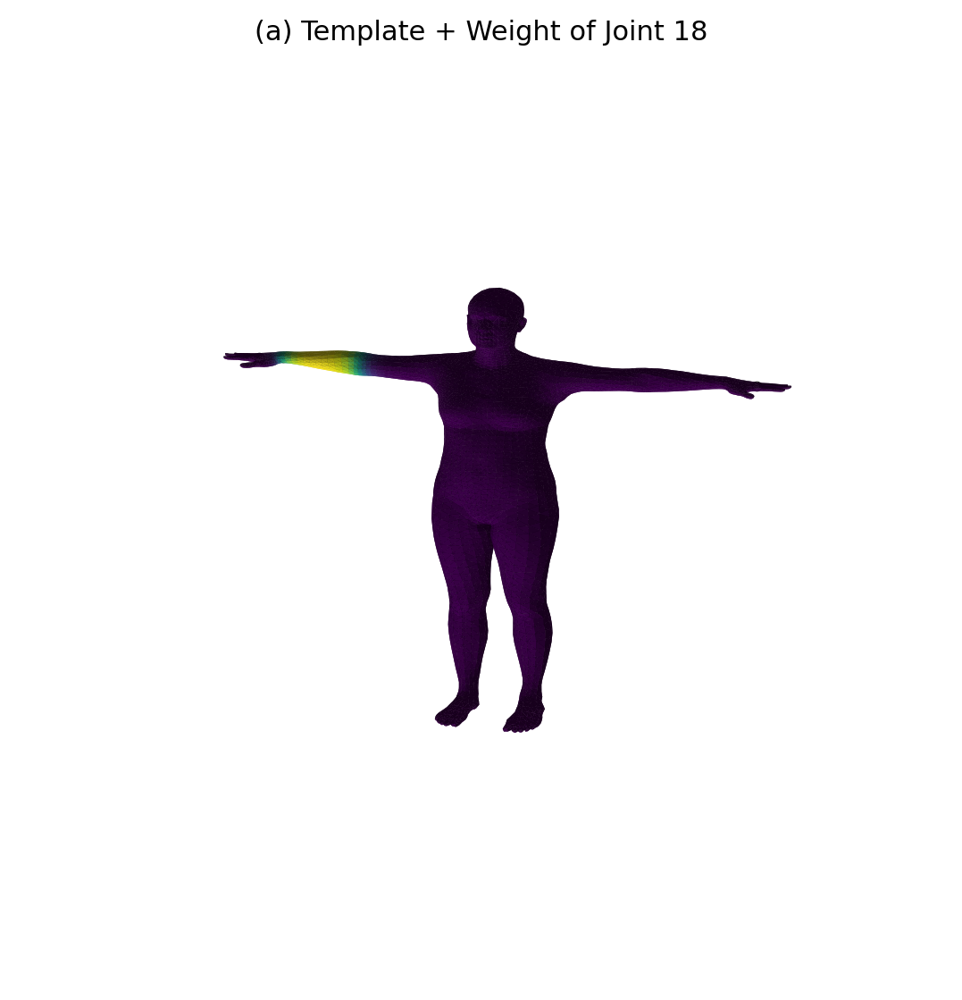
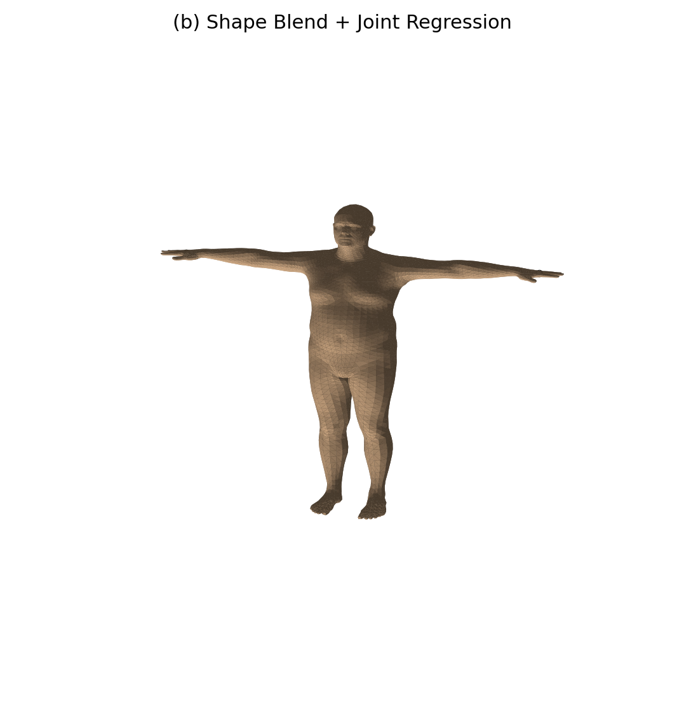
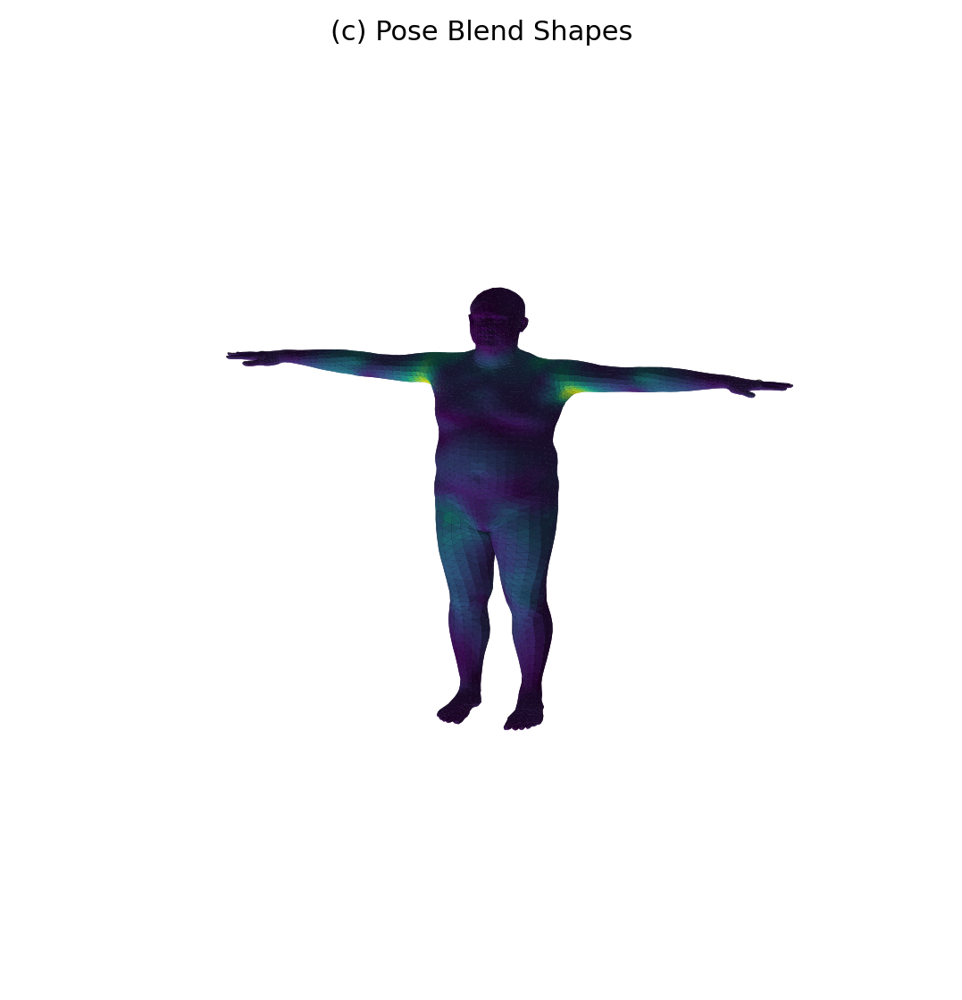
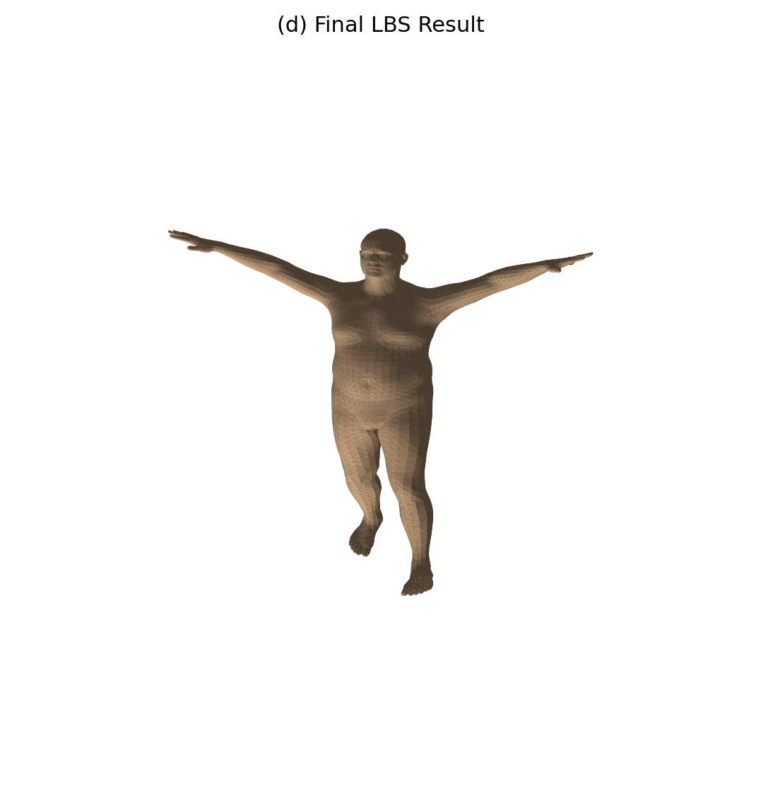
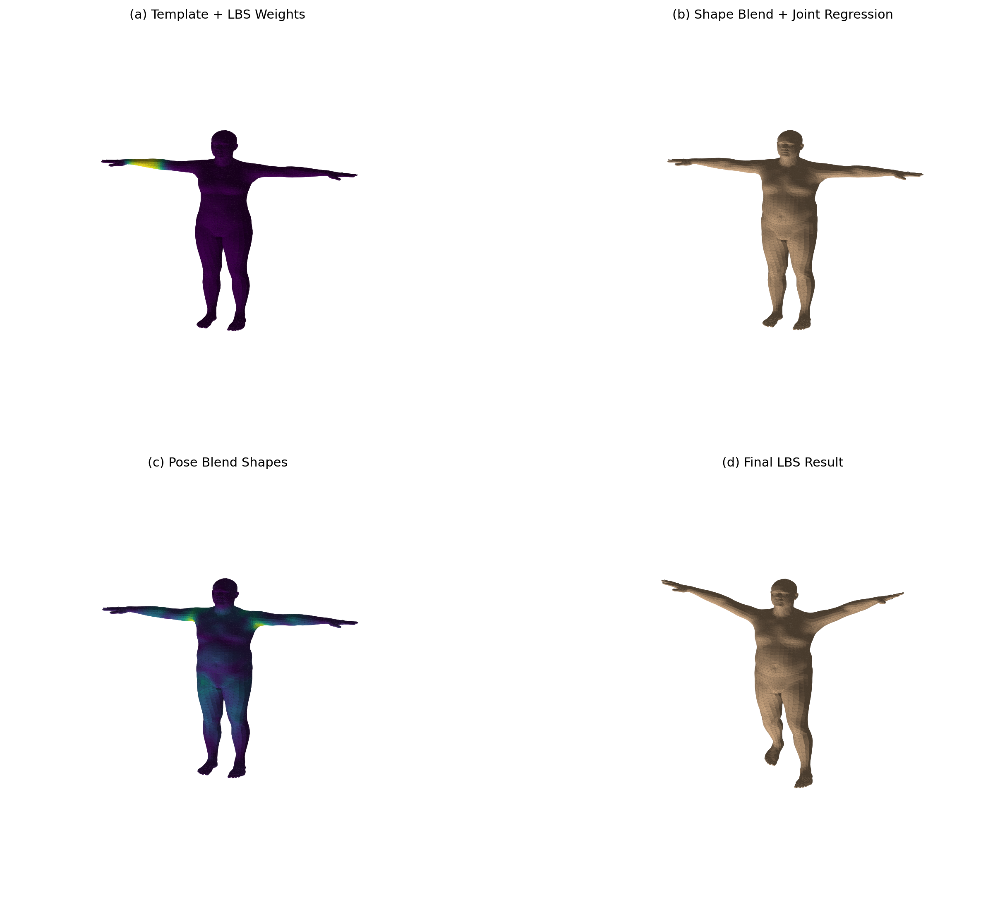
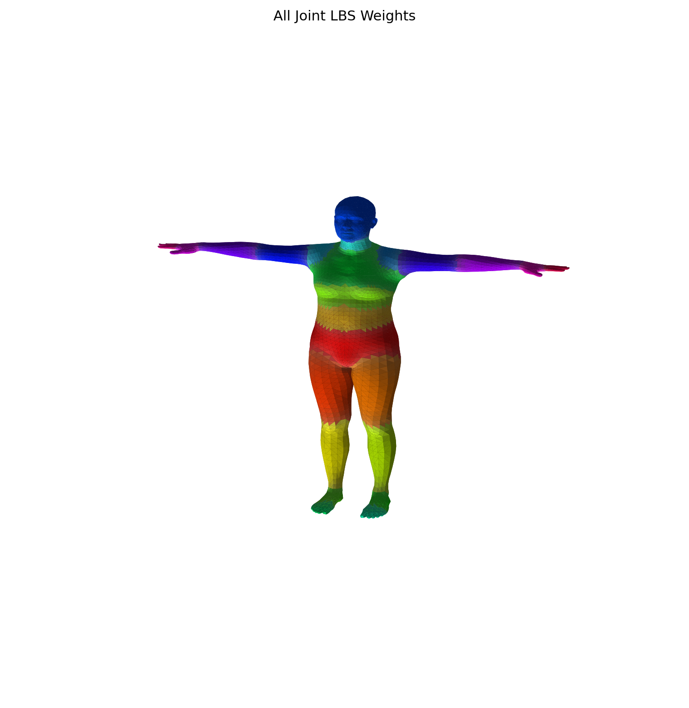

# 实验八：LBS 蒙皮（Linear Blend Skinning）

**202411081008-冯丹蕊-计算机科学与技术（公费师范）**

---

## 一、实验目标

1. 理解参数化人体模型（SMPL）中模板网格、形状参数、姿态参数、关节回归器和蒙皮权重之间的关系；
2. 完整理解并手写实现 LBS 的四个阶段：模板网格与蒙皮权重 → 形状校正 → 姿态校正 → 线性混合蒙皮；
3. 学会调用 smplx 库加载 SMPL 模型，提取关键中间量并逐阶段可视化；
4. 将手写 LBS 结果与官方 forward 逐顶点对比，量化验证实现的正确性；
5. 选做：固定形状参数，驱动单关节从 −0.8 rad 旋转到 +0.8 rad，生成 30 帧动画，观察 LBS 权重驱动下的皮肤平滑运动。

---

## 二、实验原理

### 2.1 SMPL 模型概述

SMPL（Skinned Multi-Person Linear Model）是一个参数化人体网格模型，将人体外观分解为**形状**（Shape）和**姿态**（Pose）两个正交参数空间，通过线性混合蒙皮将参数映射到最终网格顶点位置。

五个核心变量：

| 变量 | 含义 | 维度 |
|------|------|------|
| `v_template` $\bar{T}$ | T-pose 模板顶点 | $(6890, 3)$ |
| `v_shaped` | 形状校正后顶点 | $(6890, 3)$ |
| `J` | 由 `v_shaped` 回归的关节位置 | $(24, 3)$ |
| `v_posed` | 姿态校正后顶点 | $(6890, 3)$ |
| `verts` | LBS 蒙皮后的最终顶点 | $(6890, 3)$ |

### 2.2 四阶段 LBS 流程

#### 阶段 (a)：模板网格与蒙皮权重

初始状态是处于 T-pose 的模板网格 $\bar{T}$，网格未受任何形状或姿态参数影响。每个顶点已携带对 24 个关节的影响权重 $\mathcal{W} \in \mathbb{R}^{6890 \times 24}$，满足：

$$\sum_{k=1}^{24} w_{ik} = 1, \quad w_{ik} \geq 0$$

权重决定后续蒙皮时每个顶点"跟随哪些骨骼运动"。

#### 阶段 (b)：形状校正 $B_S(\beta)$

形状参数 $\beta \in \mathbb{R}^{10}$ 由形状基向量 `shapedirs` 线性组合得到形状校正量：

$$T_{shape} = \bar{T} + B_S(\beta) = \bar{T} + \sum_{n=1}^{|\beta|} \beta_n \mathbf{S}_n$$

关节位置通过关节回归器从形状后的网格回归，而非固定常数：

$$J(\beta) = \mathcal{J} \cdot T_{shape}$$

这保证了不同体型下关节位置与身体几何的自洽性。

#### 阶段 (c)：姿态校正 $B_P(\theta)$

人体弯曲时，肘部、膝盖等处会发生超出刚体旋转范围的额外几何变化。SMPL 在进入真正 LBS 前加入姿态混合形状校正：

$$T_P(\beta, \theta) = T_{shape} + B_P(\theta)$$

计算流程：
1. 将轴角姿态参数转为旋转矩阵：$R = \text{Rodrigues}(\theta)$
2. 构造姿态特征（去除单位姿态，只保留偏差）：$\text{pose\_feature} = R(\theta) - I$
3. 线性映射到姿态偏移：$B_P(\theta) = \text{posedirs} \cdot \text{pose\_feature}$

#### 阶段 (d)：线性混合蒙皮

基于运动学树计算每个关节的全局刚体变换 $G_k$，对每个顶点做加权混合：

$$v_i' = \sum_{k=1}^{K} w_{ik} \, G_k(\theta, J(\beta)) \begin{bmatrix} v_i^{posed} \\ 1 \end{bmatrix}$$

最终顶点位置是多个关节变换的**线性**加权和，这正是"Linear Blend Skinning"名称的来源。

### 2.3 思考题解答

**为什么一个顶点不只受一个关节影响？**

人体皮肤是连续柔性体，关节过渡区域同时受多个骨骼牵引。若仅由单个关节控制，运动时边界处会出现硬性断裂伪影。多关节加权混合使过渡区域随相邻骨骼共同平滑运动。

**权重集中 vs. 权重均匀分布的效果？**

- 权重集中：顶点跟着该关节做刚体旋转，运动精确但过渡边界可能出现折叠；
- 权重均匀：顶点被多个关节"平均拉扯"，运动平滑但可能出现体积塌陷（"糖果纸效应"）。

**为什么关节位置要从形状后的网格回归？**

若关节位置固定，体型变高变胖后，膝关节仍在原始位置，与身体几何不符，导致 LBS 时整条腿的变换基准错误。从 `v_shaped` 回归关节，保证了关节始终处于身体几何的正确解剖位置。

**为什么 LBS 之前要加 pose corrective？**

纯刚体 LBS 无法表达皮肤弯曲时的体积保持行为，肘部弯曲时会出现明显的体积塌陷。`pose_offsets` 通过数据驱动学习的线性映射补偿这一缺陷，使弯曲处的几何更接近真实人体。

**$J$ 和 $J_{transformed}$ 的区别？**

$J(\beta)$ 是 T-pose 下的关节参考位置（LBS 的输入基准），$J_{transformed}$ 是经过运动学链全局变换后的最终骨架位置（实际姿态下的可视化位置）。

---

## 三、项目结构

```

Work7/
├── run_lbs_lab.py                  # 完整实现（必做 + 选做共用一份代码）
├── stage_a_template_weights.png    # 阶段 (a)：模板网格 + 单关节权重热力图
├── stage_b_shaped_joints.png       # 阶段 (b)：形状校正 + 关节回归
├── stage_c_pose_offsets.png        # 阶段 (c)：姿态校正可视化
├── stage_d_lbs_result.png          # 阶段 (d)：最终 LBS 结果
├── comparison_grid.png             # 四阶段总对比图
├── all_joint_weights.png           # 全关节主导权重分布（辅助图）
├── summary.txt                     # 模型信息 + 误差验证
├── README.md
└── animation_frames/               # 选做：30 帧动画序列
├── frame_0000.png
├── frame_0001.png
├── ...
└── frame_0029.png

````

**运行命令：**

```bash
# 必做
python run_lbs_lab.py --model-dir ./models --out-dir . --joint-id 18

# 必做 + 选做（同一份代码，追加 --animate 参数即可）
python run_lbs_lab.py --model-dir ./models --out-dir . \
    --joint-id 18 --animate --animate-joint 17 --animate-frames 30
````

---

## 四、核心实现说明

### 4.1 chumpy 兼容层

官方 SMPL `.pkl` 文件使用 `chumpy` 数组序列化，直接 `pickle.load` 会因找不到 `chumpy` 模块而报错。通过在 `sys.modules` 中注入垫片模块解决，无需实际安装 chumpy：

```python
def install_chumpy_pickle_shim():
    chumpy_ch_module.Ch = _ChumpyArrayShim  # 自定义 __array__ 使其可转 numpy
    sys.modules["chumpy"] = chumpy_module
    sys.modules["chumpy.ch"] = chumpy_ch_module
```

### 4.2 手写 LBS 核心流程

```python
def compute_manual_lbs(model, betas, global_orient, body_pose):
    # 阶段 (a)：模板网格
    v_template = model.v_template.unsqueeze(0)             # (1, 6890, 3)

    # 阶段 (b)：形状校正 + 关节回归
    v_shaped = v_template + blend_shapes(betas, shapedirs) # (1, 6890, 3)
    J = vertices2joints(model.J_regressor, v_shaped)       # (1, 24, 3)

    # 阶段 (c)：姿态校正
    rot_mats = batch_rodrigues(full_pose.view(-1, 3)).view(1, -1, 3, 3)
    pose_feature = (rot_mats[:, 1:] - ident).view(1, -1)  # 去除根关节后展平
    pose_offsets = torch.matmul(pose_feature, posedirs).view(1, -1, 3)
    v_posed = v_shaped + pose_offsets

    # 阶段 (d)：LBS 蒙皮
    J_transformed, A = batch_rigid_transform(rot_mats, J, model.parents)
    W = model.lbs_weights.unsqueeze(0)                     # (1, 6890, 24)
    T = torch.matmul(W, A.view(1, 24, 16)).view(1, -1, 4, 4)
    v_homo = torch.matmul(T, v_posed_homo.unsqueeze(-1))
    verts = v_homo[:, :, :3, 0]                            # (1, 6890, 3)
```

### 4.3 posedirs 维度自适应

不同版本 SMPL `.pkl` 中 `posedirs` 存储方向可能不同，运行时自动检测并转置：

```python
def prepare_posedirs(posedirs, expected_pose_dim):
    if posedirs.shape[0] == expected_pose_dim:
        return posedirs
    if posedirs.shape[1] == expected_pose_dim:
        return posedirs.T
    raise RuntimeError(f"posedirs 形状不匹配: {tuple(posedirs.shape)}")
```

### 4.4 可视化设计

| 可视化内容    | 颜色映射方案                     |
| -------- | -------------------------- |
| 单关节权重热力图 | `viridis`：权重 0 → 深紫，1 → 黄绿 |
| 姿态偏移量大小  | `viridis`：偏移越大颜色越亮         |
| 全关节主导权重图 | `hsv`：24 色相均匀分配，亮度表示主导权重强度 |
| 默认网格     | 固定肤色 + Phong 光照着色          |

所有视图统一交换 Y/Z 轴（`smpl_to_plot_coords`）并使用等比例坐标轴，避免人体比例失真。

---

## 五、实验结果

### 5.1 模型基础信息

| 项目            | 数值     |
| ------------- | ------ |
| 顶点数           | 6890   |
| 面片数           | 13776  |
| 关节数           | 24     |
| 形状参数维度（betas） | 10     |
| 可视化关节编号       | 18（左肘） |

### 5.2 手写 LBS 与官方 forward 误差验证

| 误差指标           | 数值           |
| -------------- | ------------ |
| 平均绝对误差（MAE）    | 0.0000000000 |
| 最大绝对误差（Max AE） | 0.0000000000 |

误差为机器精度级别的零，证明手写 LBS 的四阶段实现与 smplx 官方 `forward` 在数值上**完全一致**。

### 5.3 阶段 (a)：模板网格 + 单关节权重热力图




颜色越亮（黄绿）代表该顶点受第 18 关节（左肘）影响越强，集中分布在左前臂区域；躯干、腿部顶点颜色趋近深紫（权重接近 0）。此时网格处于 T-pose，未受任何形状或姿态参数影响。

### 5.4 阶段 (b)：形状校正 + 关节回归




设置 $\beta_0 = 2.0,\ \beta_1 = -1.2,\ \beta_2 = 0.8$ 后，网格体型发生明显变化，躯干和四肢比例与默认 T-pose 有所不同。叠加显示的关节点位于身体几何内部的合理解剖位置，验证了"关节随体型联动"的正确性。

### 5.5 阶段 (c)：姿态校正（Pose Blend Shapes）




颜色表示 `pose_offsets` 的 L2 范数大小，明显高亮区域集中在**肩部、肘部、髋部、膝盖**——正是设置了非零旋转的关节附近。躯干和末端偏移量接近零（深色），说明姿态校正仅在发生弯曲的区域产生几何修正。

### 5.6 阶段 (d)：最终 LBS 蒙皮结果




人体已进入目标姿态：双肩略微展开，双肘弯曲，左腿前迈，右膝微弯。关节点位于最终姿态下各骨骼的正确解剖位置。网格表面连续平滑，无明显穿插或折叠。

### 5.7 四阶段总对比图




从左上到右下清晰呈现四个阶段的递进关系：T-pose 模板 → 体型变化 → 局部姿态修正 → 最终骨骼驱动结果。

### 5.8 辅助图：全关节主导权重分布




每块面片根据"主导关节"上色（24 种色相均匀分布），颜色越亮表示该区域被某一关节高度主导。躯干过渡区域颜色复杂（多关节共同影响），四肢末端颜色单一（高度绑定到末端关节），与人体解剖学直觉吻合。

---

## 六、选做：姿态动画

### 6.1 实现方案

固定形状参数 $\beta$，驱动右肩关节（关节索引 17）绕 Z 轴从 $-0.8$ rad 旋转到 $+0.8$ rad，共生成 30 帧静态图片保存到 `animation_frames/`。

必做与选做共用同一份代码，通过 `--animate` 开关控制，无需修改任何代码逻辑：

```bash
python run_lbs_lab.py --model-dir ./models --out-dir . \
    --animate --animate-joint 17 --animate-frames 30
```

### 6.2 动画帧展示

从 30 帧中均匀抽取 6 帧，展示右肩从负角度到正角度的完整旋转过程：

|                 Frame 01                |                 Frame 07                |                 Frame 13                |                 Frame 18                |                 Frame 24                |                 Frame 30                |
| :-------------------------------------: | :-------------------------------------: | :-------------------------------------: | :-------------------------------------: | :-------------------------------------: | :-------------------------------------: |
| 
| 
 | 
 | 
 |
 | 
 |

### 6.3 观察结论

* **刚性区域**：右肩高权重区域（上臂、三角肌）跟随骨骼旋转做刚性运动，位移明显；
* **平滑过渡**：肩颈交界处（权重在肩关节与颈椎之间分配）被平滑带动，无硬性断裂；
* **权重局部性**：左侧身体和腿部（与右肩权重无关）保持静止，LBS 权重的局部性得到正确体现；
* **pose corrective 效果**：肩部弯曲处受 `pose_offsets` 补偿，几何形态比纯刚体旋转更自然。

---

## 七、环境依赖

```
Python     >= 3.10
torch      >= 2.0
smplx      >= 0.1.28
matplotlib >= 3.7
numpy      >= 1.24
```

```bash
pip install torch smplx matplotlib numpy
```

---

## 八、实验总结

1. **参数化模型的分离性设计**：SMPL 将形状（$\beta$）和姿态（$\theta$）完全解耦，两套参数在各自线性子空间内独立作用，最终通过 LBS 合并为统一网格输出。这种设计使形状和姿态可以任意组合，是参数化人体模型的核心优势。

2. **LBS 的本质是加权刚体变换**：每个顶点最终位移是多个关节刚体变换的线性加权平均。这使过渡区域天然平滑，但也带来"糖果纸效应"（体积塌陷），需要 pose corrective 补偿，这是 LBS 最经典的局限性。

3. **Pose corrective 的必要性**：实验结果清楚显示姿态校正量集中在发生弯曲的关节附近，而非全身均匀分布。这说明 SMPL 的 pose blend shapes 是数据驱动学习的结果，体现了统计模型与物理直觉相结合的建模思路。

4. **手写实现的验证价值**：手写 LBS 与官方 forward 误差为数值零，证明 smplx 的 `forward` 就是本实验四个阶段的封装，没有额外的黑盒操作。从零手写并对齐官方结果，是理解参数化模型最有效的学习路径。

5. **关节回归器的设计哲学**：不将关节位置硬编码为常数而是从网格回归，保证了形状参数改变后骨架与网格的解剖学一致性，是 LBS 能给出合理结果的前提条件，也是 SMPL 区别于早期蒙皮模型的关键设计之一。
