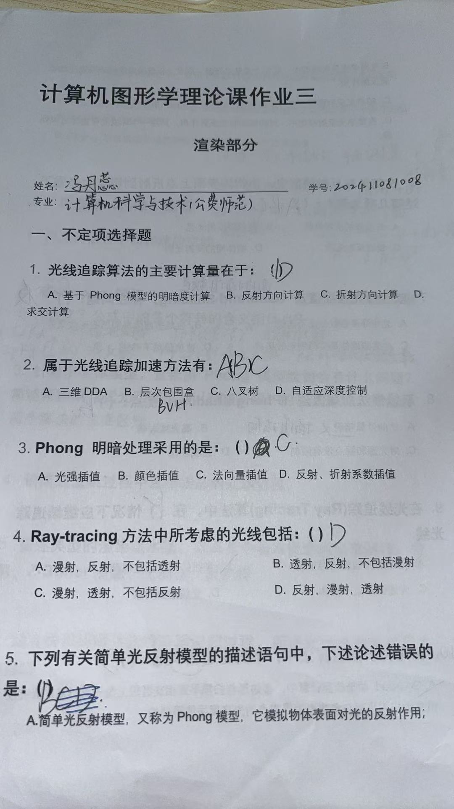
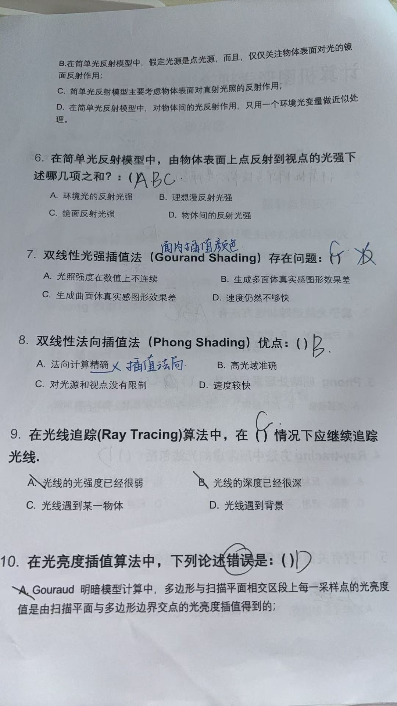

## 二、简答题

---

### 1. 用几何法求平面和球的交线

**答：**

设球心为 \( C(x_0, y_0, z_0) \)，半径为 \( R \)，平面方程为 \( ax + by + cz + d = 0 \)。

#### 第一步：计算球心到平面的距离
\[
d_0 = \frac{|ax_0 + by_0 + cz_0 + d|}{\sqrt{a^2 + b^2 + c^2}}
\]

#### 第二步：判断相交关系

- **若 \( d_0 > R \)**：平面与球**不相交**（无交线）。
- **若 \( d_0 = R \)**：平面与球**相切**，交线为一个**点**（切点）。
- **若 \( d_0 < R \)**：平面与球**相交**，交线为**一个圆**。

#### 第三步：求交圆参数（当 \( d_0 < R \) 时）

- **交圆圆心**：球心到平面的投影点
\[
O' = C - \frac{ax_0 + by_0 + cz_0 + d}{a^2 + b^2 + c^2} \cdot (a, b, c)
\]

- **交圆半径**：
\[
r = \sqrt{R^2 - d_0^2}
\]

- **交圆所在平面**：即原平面 \( ax + by + cz + d = 0 \)

**结论**：平面与球的交线是一个位于该平面上的圆，圆心为球心在平面上的投影，半径为 \( \sqrt{R^2 - d_0^2} \)。

---

### 2. Phong 光照模型各项含义及符号解释

**答：**

Phong 光照模型公式：
\[
I = I_a K_a + I_p K_d (L \cdot N) + I_p K_s (R \cdot V)^n
\]

#### 三项含义

| 项 | 名称 | 含义 |
|---|------|------|
| \( I_a K_a \) | **环境光项 (Ambient)** | 模拟场景中经过多次散射后均匀分布的背景光，与光源方向无关，为物体提供基础亮度 |
| \( I_p K_d (L \cdot N) \) | **漫反射项 (Diffuse)** | 模拟粗糙表面向各方向均匀散射的光，遵循朗伯余弦定律，强度取决于光线入射角 |
| \( I_p K_s (R \cdot V)^n \) | **镜面高光项 (Specular)** | 模拟光滑表面反射的强光，强度取决于观察方向与理想反射方向的夹角，\( n \) 控制高光锐利程度 |

#### 各符号含义

| 符号 | 含义 |
|------|------|
| \( I \) | 最终输出颜色 |
| \( I_a \) | 环境光强度 |
| \( I_p \) | 点光源强度 |
| \( K_a \) | 环境光反射系数（材质属性，0~1） |
| \( K_d \) | 漫反射系数（材质属性，0~1） |
| \( K_s \) | 镜面反射系数（材质属性，0~1） |
| \( L \) | 从顶点指向光源的单位方向向量 |
| \( N \) | 顶点处单位法向量 |
| \( R \) | 光线的理想反射方向单位向量 |
| \( V \) | 从顶点指向视点的单位方向向量 |
| \( n \) | 高光指数（Shininess），控制高光区域大小 |

---

### 3. 多面体模型使用 Phong 模型的问题及增量式光照模型

**答：**

#### 问题

直接用 Phong 模型逐顶点计算后，再对三角形内部进行颜色插值（Gouraud 着色），会导致：
- **高光丢失**：如果高光点落在三角形内部而非顶点处，插值会完全丢失高光效果。
- **马赫带效应**：颜色线性插值无法正确表现曲面高光的非线性变化，产生视觉条带。

#### 两种增量式光照模型

| 算法 | Gouraud 着色（明暗插值） | Phong 着色（法向量插值） |
|------|------------------------|------------------------|
| **基本思想** | 先计算各顶点颜色，再在三角形内部对颜色进行双线性插值 | 先对各顶点法向量进行双线性插值，再用插值后的法向量逐像素计算光照 |
| **计算量** | 较小，每个顶点计算一次光照 | 较大，每个像素都要计算光照 |
| **高光效果** | 可能丢失高光 | 能正确表现高光 |
| **适用范围** | 漫反射为主的场景 | 需要镜面高光的场景 |

#### 主要区别

> **Phong 着色是对法向量插值后再计算光照，Gouraud 着色是对颜色插值后再输出。** Phong 着色能捕捉到三角形内部的高光变化，但计算量远大于 Gouraud 着色。

---

### 4. 简述渲染过程中三维图形的处理流程

**答：**

三维图形渲染的核心流程（渲染管线）如下：

#### 阶段一：应用阶段（Application Stage）

- 场景数据准备（几何体、材质、光源、摄像机参数）
- 视锥体裁剪（粗粒度）
- 设置渲染状态

#### 阶段二：几何阶段（Geometry Stage）

| 子阶段 | 说明 |
|--------|------|
| **模型变换** | 将顶点从局部坐标系变换到世界坐标系 |
| **视图变换** | 将顶点从世界坐标系变换到摄像机坐标系 |
| **投影变换** | 将顶点从摄像机坐标系变换到裁剪坐标系（透视/正交投影） |
| **裁剪** | 剔除视锥体外的图元 |
| **屏幕映射** | 将顶点从裁剪坐标映射到屏幕坐标 |

#### 阶段三：光栅化阶段（Rasterization Stage）

| 子阶段 | 说明 |
|--------|------|
| **三角形设置/遍历** | 确定哪些像素被三角形覆盖 |
| **顶点属性插值** | 插值颜色、法线、纹理坐标等 |
| **片段着色** | 计算每个像素的最终颜色（纹理采样、光照计算） |
| **逐像素操作** | 深度测试（Z-Buffer）、模板测试、混合（Alpha Blending） |

#### 阶段四：输出阶段

- 将帧缓冲区输出到显示设备

> **核心流程**：顶点输入 → 顶点着色器 → 曲面细分 → 几何着色器 → 裁剪 → 光栅化 → 片段着色器 → 深度/模板测试 → 输出合并 → 显示

---

### 5. 渲染流水线中的裁剪、Z-Buffer消隐、光栅化、反走样

**答：**

#### （1）裁剪（Clipping）

**定义**：剔除位于视锥体（View Frustum）之外或部分在外的图元（三角形、线段）。

**目的**：
- 避免对不可见图元进行无谓计算（提升性能）
- 防止顶点坐标超出裁剪空间范围导致计算异常

**方法**：常用 Sutherland-Hodgman 算法，通过逐边裁剪将多边形限制在视锥体内。

---

#### （2）Z-Buffer 消隐（Z-Buffer / Depth Buffer）

**定义**：一种基于深度值的隐藏面消除技术。

**基本原理**：
1. 为每个像素维护一个深度缓冲区，存储当前已绘制片段的最小深度值。
2. 对每个片段，将其深度值与 Z-Buffer 中存储的值比较。
3. 若当前片段更靠近摄像机（深度更小），则更新颜色和深度；否则丢弃。

**特点**：
- 简单高效，硬件支持
- 与物体绘制顺序无关
- 需要额外内存存储深度值

---

#### （3）光栅化（Rasterization）

**定义**：将几何图元（三角形、线段）转换为屏幕像素的过程。

**核心步骤**：
1. **三角形设置**：计算三角形的边方程
2. **三角形遍历**：使用扫描线算法或逐像素检测，找出所有被三角形覆盖的像素
3. **属性插值**：利用重心坐标插值颜色、法线、纹理坐标等顶点属性

**输出**：一系列片段（Fragment），每个片段包含屏幕坐标、深度值和插值后的属性。

---

#### （4）反走样（Anti-Aliasing）

**定义**：减少或消除因像素采样不足导致的图像锯齿（阶梯状边缘、闪烁）的技术。

**基本原理**：使用比显示分辨率更高的采样率，通过平均多个采样点来平滑图像。

**常见方法**：

| 方法 | 说明 |
|------|------|
| **SSAA（超采样抗锯齿）** | 以更高分辨率渲染，然后降采样 |
| **MSAA（多重采样抗锯齿）** | 只在边缘处进行多次采样 |
| **FXAA（快速近似抗锯齿）** | 后处理，检测边缘并模糊 |
| **TAA（时间抗锯齿）** | 利用多帧信息累计采样 |

---

### 6. 光线追踪递归过程与加速算法

**答：**

#### 光线追踪递归过程（伪代码）

```
Color RayTrace(Ray ray, int depth) {
    // 1. 求交
    Intersection hit = FindNearestIntersection(ray);
    
    // 2. 未击中任何物体 → 返回背景色
    if (no hit) return BackgroundColor;
    
    // 3. 计算直接光照（Phong光照）
    Color localColor = ComputeLocalIllumination(hit);
    
    // 4. 递归终止条件
    if (depth >= MAX_DEPTH) return localColor;
    
    // 5. 反射光线（镜面反射）
    if (hit.object.isReflective) {
        Ray reflectRay = ComputeReflectRay(ray, hit.normal);
        Color reflectColor = RayTrace(reflectRay, depth + 1);
        localColor += reflectColor * hit.material.reflectivity;
    }
    
    // 6. 折射光线（透明物体）
    if (hit.object.isTransparent) {
        Ray refractRay = ComputeRefractRay(ray, hit.normal);
        Color refractColor = RayTrace(refractRay, depth + 1);
        localColor += refractColor * hit.material.transparency;
    }
    
    return localColor;
}
```

#### 递归过程图示

```
主光线（摄像机 → 场景）
    ↓ 击中物体表面
    计算直接光照
    ↓ 递归分支
    反射光线 → 继续求交 → 计算光照
    折射光线 → 继续求交 → 计算光照
        ↓ 递归继续
        直到达到最大深度或未击中任何物体
```

#### 递归终止条件

1. **达到最大递归深度**（如 3~5 层）
2. **光线未击中任何物体**（到达背景）
3. **光线能量衰减到可忽略**（throughput < threshold）
4. **击中漫反射表面**（漫反射表面终止反射/折射递归）

#### 光线追踪加速算法思路

**核心思想**：减少不必要的求交运算，快速排除不可能与光线相交的物体。

**主要方法**：

| 方法 | 基本思想 |
|------|----------|
| **包围盒层次（BVH）** | 用包围盒包围物体，先检测光线与包围盒是否相交，若不相交则跳过内部所有物体 |
| **空间剖分（KD-Tree/Octree）** | 将空间递归剖分为小区域，光线仅需与途经区域内的物体求交 |
| **光束追踪（Beam Tracing）** | 将光线扩展为光束，追踪一束光线而减少递归次数 |
| **光子映射（Photon Mapping）** | 从光源发射光子并存储，加速全局光照计算 |

---

### 7. 层次包围盒（BVH）与空间剖分技术

**答：**

#### （1）层次包围盒（Bounding Volume Hierarchy, BVH）

**基本原理**：
- 为场景中的物体递归构建层次化的包围盒树
- 父节点的包围盒完全包含其所有子节点的包围盒
- 光线求交时，先检测父节点包围盒，若不相交则跳过整个子树

**数据结构**：
- **叶子节点**：存储单个几何体或面片
- **内部节点**：存储包围盒和指向子节点的指针

**构建方式**：
- 自顶向下递归划分（按空间坐标划分物体）
- 常用划分策略：Spatial Median、SAH（Surface Area Heuristic）

**求交算法**：
```
Intersect(Ray ray, Node node) {
    if (!IntersectBox(ray, node.bbox)) return false;
    if (node.isLeaf) return IntersectObject(ray, node.object);
    return Intersect(ray, node.left) OR Intersect(ray, node.right);
}
```

**优点**：构建相对简单，对动态物体支持较好。

---

#### （2）空间剖分技术（Spatial Partitioning）

将三维空间划分为多个规则或不规则的小区域，光线仅需检测途经区域内的物体。

| 方法 | 说明 |
|------|------|
| **均匀网格（Uniform Grid）** | 将空间均匀划分为网格，记录每个网格中的物体，光线按步进方式遍历网格 |
| **八叉树（Octree）** | 将空间递归划分为 8 个子立方体（空间八等分），直到每个子空间物体数小于阈值 |
| **KD-Tree** | 用轴对齐平面递归分割空间，每次选择最优分割方向，用 BSP 树思想但限制分割面与坐标轴对齐 |

**与 BVH 的区别**：

| 特性 | BVH | KD-Tree / Octree |
|------|-----|------------------|
| 划分依据 | 按物体划分（物体驱动） | 按空间划分（空间驱动） |
| 每个空间区域 | 包含多个物体 | 划分空间，物体可能跨多个区域 |
| 动态场景支持 | 较好 | 较差（需重建） |
| 内存占用 | 较小 | 较大 |

---

### 8. 空间八叉树剖分技术（Octree）

**答：**

#### 基本思想

将三维空间递归划分成 8 个大小相同的子立方体，直到每个子立方体内的物体数量满足终止条件。

#### 数据结构

```
OctreeNode {
    BBox bbox;                // 当前立方体空间范围
    ObjectList objects;       // 包含的物体
    OctreeNode children[8];   // 8个子节点（若为叶节点则为空）
    bool isLeaf;
}
```

#### 构建过程

1. 用一个立方体包围整个场景作为根节点。
2. 若当前立方体包含的物体数超过阈值，将该立方体等分为 8 个子立方体。
3. 将物体分配到对应的子立方体中（跨越边界的物体可存储于父节点或复制到多个子节点）。
4. 递归执行，直到所有叶节点满足终止条件。

#### 立方体网格编码与空间坐标关系

设八叉树深度为 \( d \)，每个节点在深度 \( k \) 的位置可由一个三维索引 \( (i_x, i_y, i_z) \) 唯一标识，其中 \( 0 \leq i_x, i_y, i_z < 2^k \)。

**编码方式**：
- 每个子节点对应一个 3 位编码（0~7），每位代表一个维度（x, y, z）
- 路径编码由根到叶的节点编码连接而成

**空间坐标关系**：
- 若世界空间范围 \( [0, W] \times [0, W] \times [0, W] \)
- 深度 \( k \)，索引 \( (i_x, i_y, i_z) \) 对应的立方体范围为：
\[
\begin{aligned}
x &\in \left[i_x \cdot \frac{W}{2^k},\ (i_x+1) \cdot \frac{W}{2^k}\right] \\
y &\in \left[i_y \cdot \frac{W}{2^k},\ (i_y+1) \cdot \frac{W}{2^k}\right] \\
z &\in \left[i_z \cdot \frac{W}{2^k},\ (i_z+1) \cdot \frac{W}{2^k}\right]
\end{aligned}
\]

**性质**：
- 父节点与子节点的编码关系：父节点编码为 \( P \)，子节点编码为 \( P \cdot 8 + c \)，其中 \( c \in [0, 7] \)。
- 相邻节点的查找可通过索引加减 1 实现，无需遍历树结构。

#### 光线追踪中的八叉树遍历

1. 从根节点开始，检测光线是否与当前节点包围盒相交。
2. 若相交且为叶节点，检测光线与内部物体的交点。
3. 若为内部节点，按光线与子节点距离排序，递归进入子节点。
4. 剪枝：找到交点后，跳过距离更远的节点（优化）。

---

### 9. 光线追踪算法的追踪终止条件

**答：**

光线追踪递归的终止条件有以下几种：

#### 1. 达到最大递归深度
- **说明**：设置递归深度上限（通常 3~5 层），达到后停止追踪。
- **目的**：防止无限递归，控制计算复杂度。
- **示例**：`if (depth >= MAX_DEPTH) return localColor;`

#### 2. 光线未击中任何物体
- **说明**：光线与场景中所有物体均无交点，超出场景边界。
- **处理**：返回背景色或环境光颜色。

#### 3. 光线能量衰减到可忽略
- **说明**：光线吞吐量（throughput）低于某一阈值，对最终颜色贡献极小。
- **处理**：停止追踪，节省计算资源。
- **示例**：`if (throughput < EPSILON) return 0;`

#### 4. 击中漫反射表面
- **说明**：在 Whitted 风格光线追踪中，漫反射表面不产生镜面反射或折射光线。
- **处理**：计算直接光照后终止递归。

#### 5. 击中光源
- **说明**：光线直接击中光源，贡献直接光照。
- **处理**：返回光源颜色后终止。

#### 6. 俄罗斯轮盘赌（Russian Roulette）
- **说明**：以一定概率随机终止追踪，用于无偏路径追踪中在保证无偏性的同时控制计算开销。

---

### 10. 全局光照与局部光照

**答：**

#### 局部光照（Local Illumination）

| 项目 | 说明 |
|------|------|
| **定义** | 仅考虑光源直接照射到物体表面的光照贡献 |
| **包含的光线** | 直接光（光源 → 物体 → 摄像机） |
| **不考虑** | 物体之间的反射、折射、散射 |
| **代表模型** | Phong 模型、Blinn-Phong 模型 |
| **优点** | 计算简单、速度快 |
| **缺点** | 无法表现间接光照效果（如颜色溢出、柔和阴影、焦散） |

#### 全局光照（Global Illumination）

| 项目 | 说明 |
|------|------|
| **定义** | 综合考虑所有光照路径，包括直接光照和间接光照 |
| **包含的光线** | 直接光 + 多次反射/折射/散射光 |
| **代表方法** | 光线追踪（Path Tracing）、辐射度（Radiosity）、光子映射 |
| **优点** | 效果真实，包含环境光遮蔽、颜色溢出、柔和阴影、焦散等效果 |
| **缺点** | 计算量大，渲染速度慢 |

#### 核心区别

\[
\boxed{\text{局部光照：只考虑光从光源 → 物体 → 眼睛}}
\]
\[
\boxed{\text{全局光照：考虑光从光源 → 物体 → 物体 → ... → 眼睛}}
\]

> **局部光照是全局光照的一个子集**。全局光照通过模拟光线在场景中的多次弹射，能够产生更加真实的光照效果。

---

### 11. BRDF 模型及其分类，原始 Phong 模型的可逆性修改

**答：**

#### BRDF 定义

**BRDF**（Bidirectional Reflectance Distribution Function，双向反射分布函数）描述了入射方向 \( \omega_i \) 的光线在出射方向 \( \omega_o \) 上的反射特性。

\[
f_r(\omega_i, \omega_o) = \frac{dL_o(\omega_o)}{dE_i(\omega_i)}
\]

其中：
- \( L_o \) 为出射辐射亮度
- \( E_i \) 为入射辐照度

**物理约束**：
1. **可逆性（Helmholtz Reciprocity）**：\( f_r(\omega_i, \omega_o) = f_r(\omega_o, \omega_i) \)
2. **能量守恒**：\( \int_{\Omega} f_r(\omega_i, \omega_o) \cos\theta_o \, d\omega_o \leq 1 \)

#### BRDF 分类

| 类型 | 说明 | 代表模型 |
|------|------|----------|
| **经验模型（Empirical）** | 基于视觉观察，非物理精确，计算简单 | Phong, Blinn-Phong |
| **基于物理的模型（Physically-based）** | 基于微表面理论，满足能量守恒和可逆性 | Cook-Torrance, GGX |
| **数据驱动模型（Data-driven）** | 基于实测数据 | MERL BRDF 数据库 |

#### 原始 Phong 模型及可逆性修改

**原始 Phong 模型的 BRDF 形式**：

原始 Phong 模型不是严格的 BRDF 形式，因为它不满足能量守恒和可逆性：

\[
f_{Phong} = \frac{k_d}{\pi} + k_s \frac{n+2}{2\pi} (R \cdot V)^n
\]

**问题**：
- 原始 Phong 模型不满足能量守恒
- 不是严格的 BRDF（缺少 \( \cos\theta_i \) 项）

**为满足可逆性所作的修改**：

**修改后（归一化 Phong / Phong BRDF）**：

\[
f_r(\omega_i, \omega_o) = \frac{k_d}{\pi} + k_s \frac{n+2}{2\pi} (\cos\theta_r)^n
\]

其中 \( \theta_r \) 是反射方向与出射方向的夹角。

**修改要点**：
1. **漫反射项改为 \( \frac{k_d}{\pi} \)**：使漫反射项满足能量守恒（半球积分等于 \( k_d \)）
2. **镜面项改为 \( k_s \frac{n+2}{2\pi} (\cos\theta_r)^n \)**：归一化使半球积分等于 \( k_s \)
3. **角度量采用反射向量与出射方向的点积**：满足对称性要求

**对比**：

| 特性 | 原始 Phong | 归一化 Phong BRDF |
|------|-----------|-------------------|
| 能量守恒 | ❌ 不满足 | ✅ 满足 |
| 可逆性 | ❌ 不满足 | ✅ 满足 |
| 物理有效性 | 经验模型 | 基于物理的近似 |
| 材质参数直观性 | ✅ 直观 | ✅ 直观 |

---

### 12. 可微渲染与深度学习的结合思路和应用

**答：**

#### 什么是可微渲染（Differentiable Rendering）

可微渲染是一种允许梯度从渲染图像反向传播到场景参数的渲染技术。它通过使渲染过程中的每个操作都可微（可求导），使得渲染成为一个可微函数：
\[
\text{Image} = \text{Render}(Scene\text{ Parameters})
\]

#### 结合思路

**核心思想**：利用可微渲染作为“可微分渲染器”，将图像损失（Image Loss）通过渲染器反向传播到三维场景参数，从而优化三维表示。

**一般框架**：
1. 定义三维场景参数（顶点坐标、材质、光照、相机位姿等）
2. 通过可微渲染器生成二维图像
3. 计算渲染图像与目标图像之间的损失
4. 通过反向传播计算损失对场景参数的梯度
5. 使用梯度下降优化场景参数

#### 主要应用方向

| 应用 | 说明 |
|------|------|
| **逆渲染（Inverse Rendering）** | 从多视角图像重建三维几何、材质、光照 |
| **神经辐射场（NeRF）** | 利用可微体渲染优化隐式神经表示，合成新视角图像 |
| **3D 场景优化** | 从 2D 图像优化 3D 网格、纹理、姿态 |
| **相机标定** | 从图像反向优化相机位姿 |
| **材质参数估计** | 从照片估计物体的 BRDF 参数 |
| **深度学习驱动的 3D 重建** | 将可微渲染作为神经网络的监督信号 |

#### 代表性工作

| 工作 | 思路 |
|------|------|
| **OpenDR** | 将光栅化中的离散操作（如顶点到像素映射）替换为可微近似 |
| **PyTorch3D** | 提供完整的可微渲染框架（Mesh 光栅化、纹理采样） |
| **NeRF** | 用 MLP 表示连续体密度和颜色场，通过可微体渲染合成图像 |
| **NVDiffRec** | 结合可微渲染和隐式表示，从图像重建三维物体 |
| **3D Gaussian Splatting** | 用可微渲染优化 3D 高斯场景表示 |

#### 典型工作流程（以 NeRF 为例）

```
输入：多视角 RGB 图像 + 相机位姿
    ↓
构建：MLP 表示场景（位置 → 密度 + 颜色）
    ↓
渲染：体渲染（沿光线积分，可微分）
    ↓
损失：渲染图像 vs 目标图像（MSE）
    ↓
优化：反向传播更新 MLP 权重
    ↓
输出：任意新视角的合成图像
```

---

### 13. 神经辐射场（NeRF）的组成部分及其渲染过程

**答：**

#### 什么是 NeRF

**NeRF**（Neural Radiance Fields）是一种利用神经网络表示三维场景的方法，能够从稀疏的 2D 图像集合中重建连续的三维场景，并合成任意新视角的高质量图像。

#### 组成部分

| 组件 | 说明 |
|------|------|
| **MLP 网络（多层感知机）** | 核心表示，将 5D 输入映射到 4D 输出 |
| **位置编码（Positional Encoding）** | 将输入坐标映射到高维空间，提升高频细节表达能力 |
| **体渲染（Volume Rendering）** | 沿光线累积颜色和不透明度，生成 2D 图像 |
| **分层采样（Hierarchical Sampling）** | 粗采样 + 细采样，提升效率 |
| **损失函数** | 渲染图像与真实图像的 MSE 损失 |

#### MLP 输入输出

**输入**（5D 坐标）：
- 空间位置：\( \mathbf{x} = (x, y, z) \)
- 观察方向：\( \mathbf{d} = (\theta, \phi) \)

**输出**（4D 属性）：
- 颜色：\( \mathbf{c} = (r, g, b) \)
- 体积密度：\( \sigma \)（标量）

#### 位置编码

将输入坐标映射到高维空间，使 MLP 能学习高频细节：

\[
\gamma(p) = \left( \sin(2^0\pi p), \cos(2^0\pi p), \ldots, \sin(2^{L-1}\pi p), \cos(2^{L-1}\pi p) \right)
\]

#### 渲染过程

**第一步：光线生成**

对每个像素，从摄像机中心向该像素发射一条光线：
\[
\mathbf{r}(t) = \mathbf{o} + t\mathbf{d}
\]

**第二步：沿光线采样**

在光线路径上采样 \( N \) 个点（粗采样 + 细采样）：
\[
t_i \sim \text{均匀分布}(t_{near}, t_{far})
\]

**第三步：MLP 预测**

对每个采样点，输入 \( (\gamma(\mathbf{x}), \gamma(\mathbf{d})) \) 到 MLP，得到 \( (\sigma_i, \mathbf{c}_i) \)。

**第四步：体渲染积分**

沿光线累积颜色：

\[
C(\mathbf{r}) = \sum_{i=1}^N T_i \cdot \alpha_i \cdot \mathbf{c}_i
\]

其中：
- 透射率：\( T_i = \exp\left(-\sum_{j=1}^{i-1} \sigma_j \delta_j\right) \)
- 不透明度：\( \alpha_i = 1 - \exp(-\sigma_i \delta_i) \)
- \( \delta_i = t_{i+1} - t_i \)（采样点间距）

**渲染过程图示**：

```
输入：多视角 2D 图像 + 相机位姿
    ↓
阶段1：从图像提取光线集合
    ↓
阶段2：每条光线采样 N 个 3D 点
    ↓
阶段3：MLP 预测每个点的 σ 和 c
    ↓
阶段4：体渲染积分 → 像素颜色
    ↓
阶段5：MSE Loss → 反向传播 → 优化 MLP
    ↓
输出：场景的隐式 3D 表示（MLP 权重）
    ↓
渲染新视角：重复阶段2-4，得到任意视角图像
```

#### 关键特性

| 特性 | 说明 |
|------|------|
| **连续性** | 表示连续空间，非离散体素 |
| **视点依赖性** | 输入含观察方向，能表现镜面反射和光泽 |
| **逼真度** | 生成高质量的逼真图像 |
| **缺点** | 训练时间长，实时渲染困难 |
